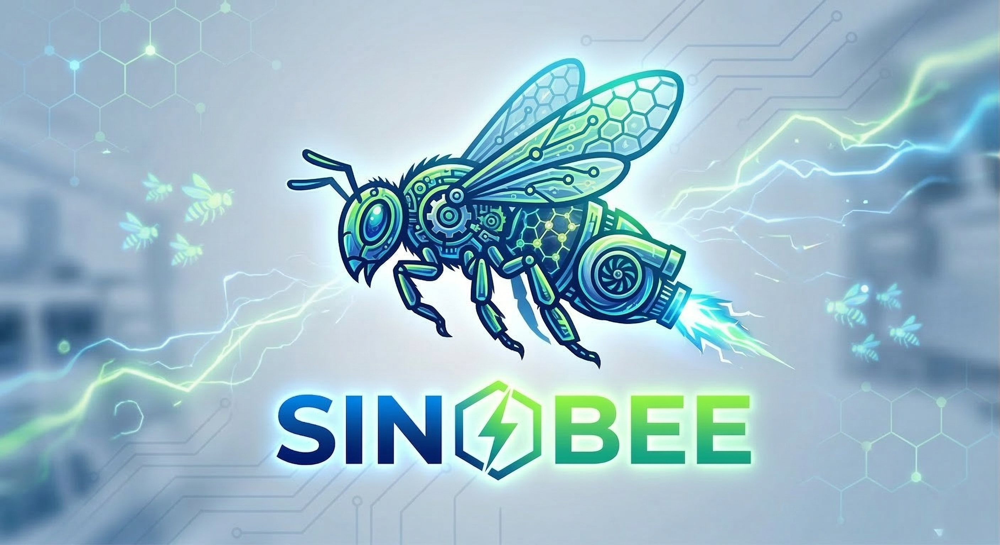

# SinoBee

> **Infinite Possibilities through Swarm Intelligence.**

SinoBee is a decentralized machine assistant network powered by cutting-edge artificial intelligence. We transform individual AI agents into digital worker bees with collaborative capabilities, utilizing swarm intelligence algorithms to achieve large-scale and highly complex task automation.

## 🌟 Core Philosophy

Inspired by the highly efficient organization of biological beehives, SinoBee operates on the principle of **Swarm Intelligence**. Instead of relying on a single monolithic AI model, we deploy an ecosystem of specialized AI agents that communicate, collaborate, and execute tasks concurrently to solve complex problems faster and more reliably.

## 🚀 Key Features

- **Decentralized Architecture**: Eliminates single points of failure. Agents operate autonomously yet maintain cohesive swarm behavior.
- **Dynamic Task Allocation**: Tasks are intelligently distributed among available "worker bees" based on their specific capabilities, context, and current workload.
- **Infinite Scalability**: Seamlessly add more agent nodes to the swarm to handle exponential increases in computational demands or massive datasets.
- **Specialized Agent Roles**:
  - 🐝 **Scout Bees (Data Fetchers)**: Focused on gathering real-world data, monitoring external systems, and identifying anomalies or opportunities (e.g., real-time financial market data fetching).
  - 🛠️ **Worker Bees (Processors)**: Dedicated to heavy computational tasks, data analysis, and executing programmed actions based on scout data.
  - 👑 **Queen Node (Orchestrator)**: Manages high-level strategy, consensus mechanism, and global task assignment.

## 🎯 Potential Applications

While the SinoBee architecture is fundamentally domain-agnostic, its power shines in scenarios requiring parallel processing and collaborative decision-making:
- **Financial Intelligence**: Fetching market data (like SinoPac stock data), performing distributed technical analysis, and automating trading signals.
- **Large-Scale Data Processing**: Breaking down massive datasets across multiple agents for concurrent parsing, cleaning, and analysis.
- **Automated Operations (AIOps)**: Swarm monitoring of complex IT infrastructures to predict failures and automate self-healing processes.
